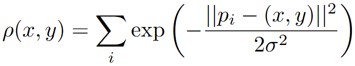

# Gravity Density Clusterization

Интерактивный инструмент для исследования плотностной кластеризации на основе гравитационной интерпретации density-field.  
Реализован на базе **Streamlit + NumPy + Matplotlib**.

Проект предназначен для визуального анализа поведения алгоритма при различных распределениях данных.

---

## 📌 Концепция

Алгоритм работает по следующему пайплайну:

1. Генерация набора точек  
2. Построение плотностного поля (KDE-подобная модель)  
3. Поиск локальных максимумов плотности (modes)  
4. Слияние близких мод  
5. Назначение точек ближайшему центру  
6. Визуализация результатов  

Вся система работает в **реальном пространстве координат**, без смешивания pixel-space и index-space.

---

## 🚀 Возможности

- Набор генераторов данных:
  - Clustered Gaussian
  - Concentric Circles
  - Spiral
  - Uniform Noise
  - Single Circle
- Интерактивная настройка параметров:
  - `SIGMA`
  - `GRID_SIZE`
  - `MERGE_RADIUS`
  - `CONTOUR_LEVEL`
- Визуализация:
  - Тепловая карта плотности
  - Контурные линии
  - Центры кластеров
  - Связи точка → центр
- Подсчёт размеров кластеров

---

## 🏗 Архитектура

```
app.py
│
├── core/
│   ├── grid.py
│   ├── density.py
│   ├── modes.py
│   ├── merge.py
│   └── clustering.py
│
├── data/
│   └── generators.py
│
└── viz/
    └── plot.py
```

### Координатная консистентность

```
points      → real space
density     → real space
modes       → real space
merge       → real space
clustering  → real space
plot        → real space
```

Никаких скрытых преобразований индексов.

---

## ⚙️ Установка

```bash
git clone https://github.com/kusrabyzarc/Gravity-Clustering.git
cd gravity_clusterization
python -m venv .venv
```

### Windows
```bash
.venv\Scripts\activate
```

### Linux / macOS
```bash
source .venv/bin/activate
```

```bash
pip install -r requirements.txt
```

---

## ▶ Запуск

```bash
streamlit run app.py
```

После запуска откроется браузер с интерактивным интерфейсом.

---

## 📊 Параметры

### SIGMA
Ширина гауссовского ядра.  
Влияет на сглаженность плотностного поля.

### GRID_SIZE
Разрешение сетки.  
Чем больше — тем выше точность, но выше вычислительная нагрузка.

### MERGE_RADIUS
Радиус объединения близких мод.

### CONTOUR_LEVEL
Уровень плотности для отрисовки изолинии.

---

## 🧠 Математическая модель

Плотность рассчитывается как сумма гауссов:



Локальные максимумы поля интерпретируются как центры притяжения.  
Каждая точка назначается ближайшему центру.

Метод концептуально близок к:

- Mean Shift
- KDE-based clustering
- Gravitational clustering

---

## 🧪 Применение

- Исследование плотностных методов кластеризации  
- Визуальный анализ поведения KDE  
- Стресс-тестирование алгоритмов  
- Образовательные задачи  

---

## 🧩 Добавление нового генератора

В файле `data/generators.py`:

1. Создать функцию генерации
2. Добавить её в `GENERATOR_REGISTRY`

```python
GENERATOR_REGISTRY = {
    "New Generator": new_generator_function
}
```

Streamlit автоматически отобразит его в интерфейсе.

---

## 📈 Возможные направления развития

- GPU-ускорение (CuPy)
- 3D-плотность
- Анимация движения точек по градиенту
- Автоматический подбор `sigma`
- Интеграция метрик качества (Silhouette, Davies–Bouldin)